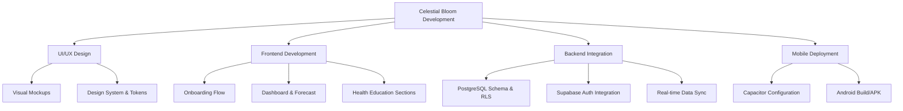
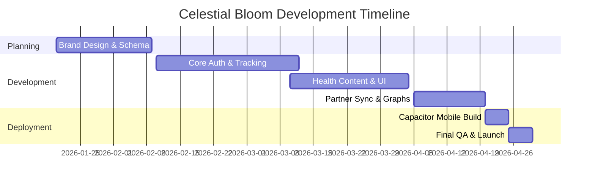
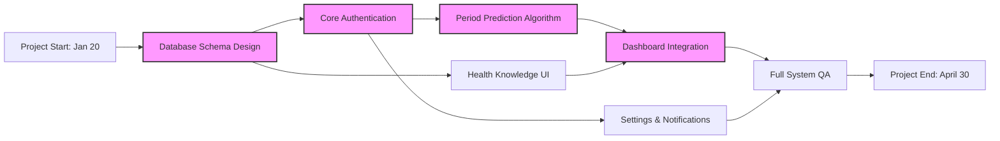
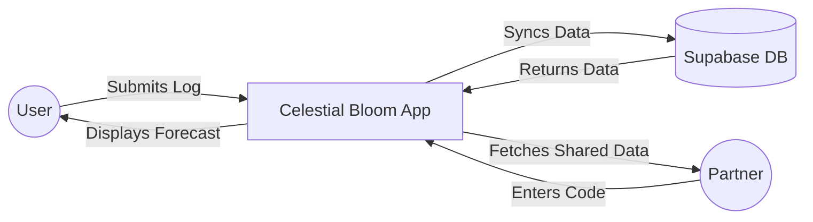
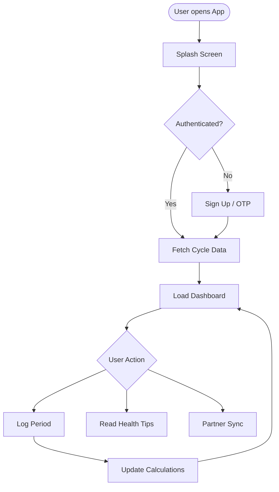
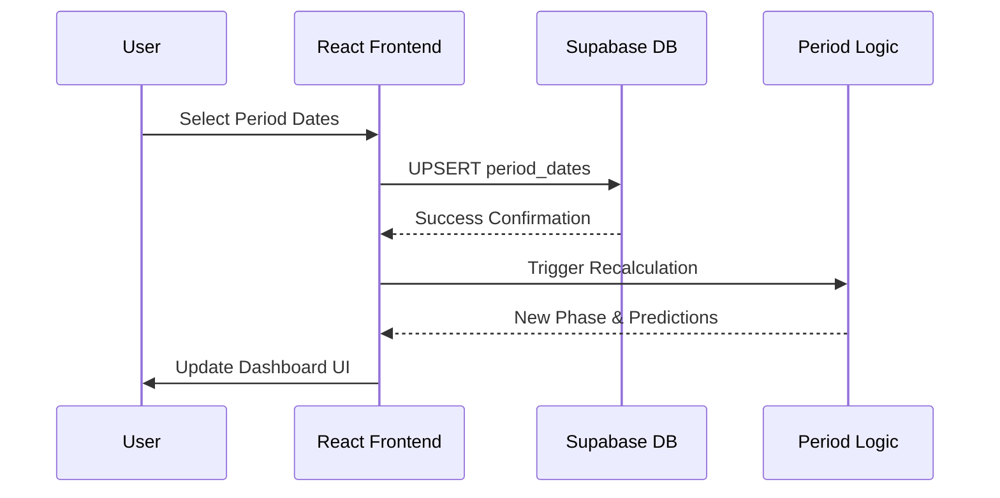
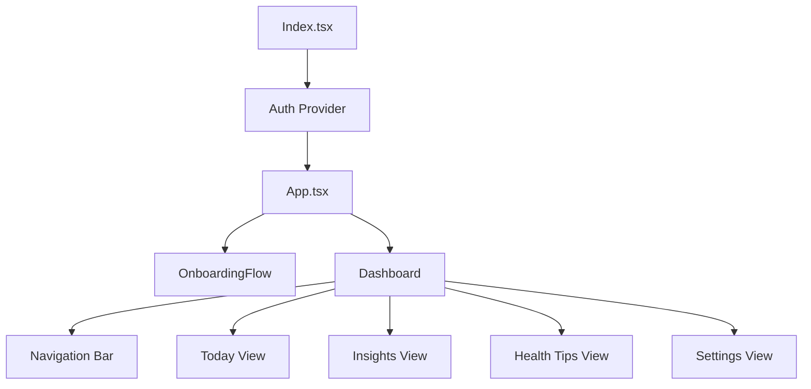
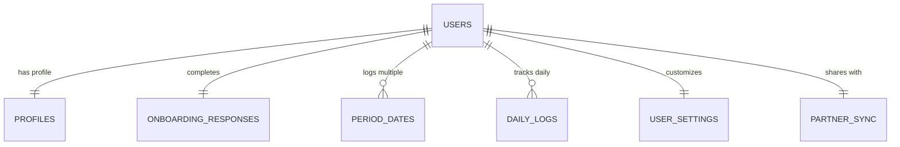
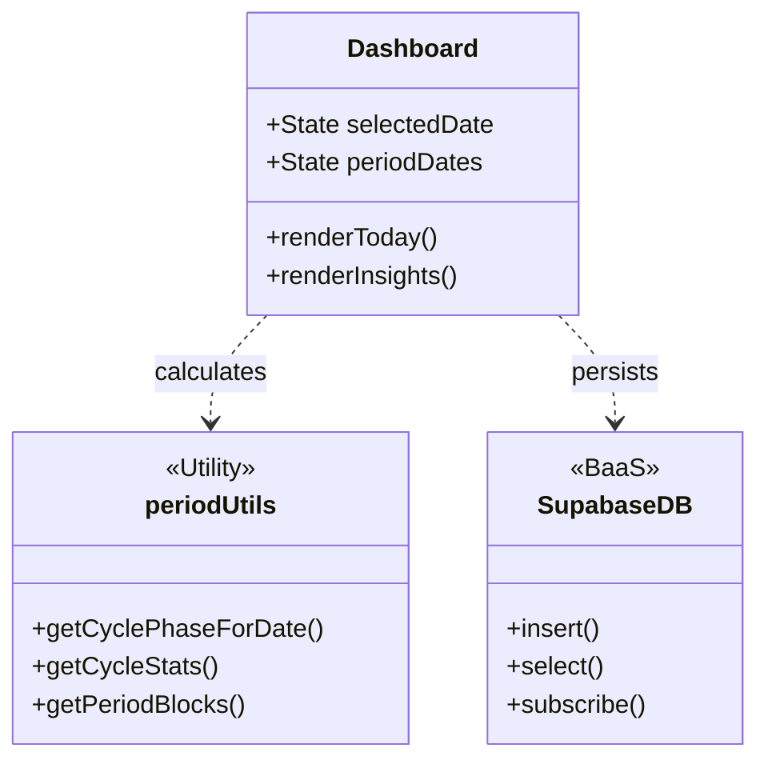
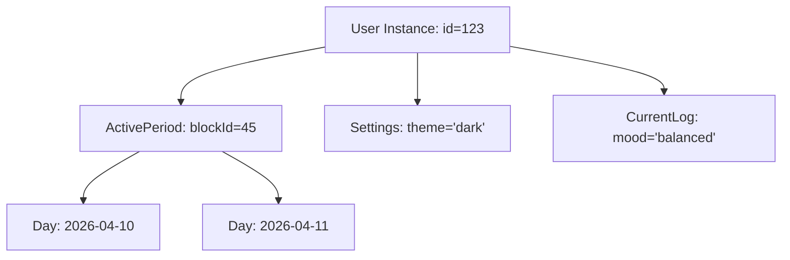

# PROJECT DOCUMENTATION: CELESTIAL BLOOM (DR. CUTERUS)

## 1. INTRODUCTION

### 1.1 Background
Menstrual health is a fundamental aspect of wellness for billions, yet it remains underserved by many traditional digital solutions. The "Celestial Bloom" (formerly Dr. Cuterus) project was conceived to address the gap in the market for a premium, aesthetic, and science-backed menstrual tracking application. By combining modern design sensibilities with robust algorithmic predictions, the application provides a holistic hub for feminine wellness.

### 1.2 Purpose of the Project
The primary purpose is to provide users with a secure, private, and intuitive platform to track their menstrual cycles, log daily symptoms, and access educational health content. It aims to demystify bodily changes through data-driven insights and foster a deeper connection between users and their reproductive health.

### 1.3 Project Scope
The project scope includes:
- **Core Tracking**: Period logging and cycle visualization.
- **Predictive Analytics**: Algorithmic forecasting of future periods, ovulation, and fertile windows.
- **Health Education**: Interactive modules on bacterial health, life stages, and daily wellness tips.
- **Cross-Platform Accessibility**: Built as a web application with mobile integration via Capacitor.
- **Data Synchronization**: Real-time cloud sync and auth powered by Supabase.
- **Partner Sync**: A unique feature allowing users to share cycle status with partners.

### 1.4 Project Objectives
- Achieve high prediction accuracy using moving average cycle statistics.
- Provide a "premium" visual experience with fluid animations and harmonious color palettes.
- Ensure 100% data privacy through Supabase Row Level Security (RLS).
- Enable seamless transition between web and mobile environments.

---

## 2. PROJECT PLANNING AND SCHEDULING

### 2.1 Project Plan
The project followed an iterative development lifecycle, divided into five major phases:
1. **Inception & Design**: (Jan 20 - Feb 10) - Brand identity, UI/UX mockups, and database schema design.
2. **Core Development**: (Feb 11 - March 15) - Implementation of auth, period logging, and the tracking algorithm.
3. **Feature Expansion**: (March 16 - April 10) - Adding health modules, symptoms logging, and charts.
4. **Mobile & Sync**: (April 11 - April 20) - Capacitor integration and Partner Sync functionality.
5. **Testing & Polishing**: (April 21 - April 30) - Bug fixing, performance optimization, and final deployment.

### 2.2 Work Breakdown Structure (WBS)


**EXPLANATION**:
The WBS decomposes the project into manageable work packages. 
- **Design Layer**: Focuses on the "Celestial Bloom" aesthetic, ensuring brand consistency across web and mobile.
- **Frontend (FE)**: Handles the complex client-side logic for cycle tracking and the responsive UI.
- **Backend (BE)**: Manages the data persistence layer using Supabase, focusing on security via Row Level Security (RLS).
- **Mobile Layer**: Bridges the web application to a native mobile environment using Capacitor for Android distribution.

### 2.3 Gantt Chart


**EXPLANATION**:
The Gantt chart illustrates the project schedule and dependencies. 
- **Phase 1 (Planning)**: Establishes the database foundation (SQL) which is prerequisite for all other work.
- **Phase 2 (Core Development)**: Focuses on the "Must-Have" features (Auth & Tracking) during the peak development period in February/March.
- **Phase 3 (Expansion)**: Parallel development of secondary features (Health Content) while stabilizing core logic.
- **Phase 4 (Deployment)**: Dedicated time for mobile compilation and QA ensures a bug-free launch on April 30.

### 2.4 PERT Chart / CPM (Critical Path Method)


**EXPLANATION**:
The PERT chart identifies the **Critical Path** (highlighted in pink). Any delay in these tasks will directly delay the final delivery. The path for "Celestial Bloom" is defined by the data dependency: **Schema -> Auth -> Forecast Logic -> Dashboard**. Tasks like "Health Knowledge UI" are important but have "Slack Time," meaning they can be completed in parallel without delaying the project end date if they take slightly longer.

### 2.5 Team Structure and Responsibilities
- **Frontend Developer**: Responsible for UI/UX implementation, Framer Motion animations, Recharts integration, and mobile adaptation via Capacitor.
- **Backend Developer**: Responsible for Supabase configuration, PostgreSQL schema management, Row Level Security (RLS) policies, and API efficiency.

### 2.6 Project Development Methodology
**Agile Methodology (Scrum)**:
- 2-week Sprint cycles.
- Daily standups for progress tracking.
- Continuous Integration/Continuous Deployment (CI/CD) for rapid iteration.

### 2.7 Hardware and Software Requirements
- **Hardware**: Development workstations (PC/Mac), Android/iOS devices for mobile testing.
- **Software**: React 18, Vite, TypeScript, Tailwind CSS, Supabase, Capacitor 6, Vitest, Lucide React.

---

## 3. SYSTEM ANALYSIS

### 3.1 Problem Description
#### 3.1.1 Problem Definition
Many existing menstrual trackers are cluttered with advertisements, lack comprehensive health education, or fail to provide a premium user experience. Additionally, privacy concerns regarding health data are a major deterrent for users. "Celestial Bloom" addresses these by focusing on a clean, medical-grade yet aesthetic interface with strict data privacy.

#### 3.1.2 Proposed Solution
A unified wellness hub that utilizes historical data to predict future cycles while providing bite-sized health knowledge. The application features a mobile-first design, secure cloud synchronization, and modular health sections (Bacterial Health, Life Stages, etc.) to educate users throughout their cycle.

### 3.2 Requirements
#### 3.2.1 Functional Requirements
- **FR1**: User authentication (Email/OTP) and Profile management.
- **FR2**: Menstrual cycle logging (start/end dates).
- **FR3**: Automatic prediction of future periods and ovulation based on user history.
- **FR4**: Daily symptom and mood logging.
- **FR5**: Health information repository (articles/tips).
- **FR6**: Sync cycle data with a partner via a unique sync code.

#### 3.2.2 Non-Functional Requirements
- **NFR1 (Security)**: Data must be encrypted at rest and protected by RLS.
- **NFR2 (Aesthetics)**: Interface must use high-quality typography, pastel themes, and fluid Framer Motion transitions.
- **NFR3 (Performance)**: Forecast calculations should happen client-side for immediate feedback.
- **NFR4 (Reliability)**: Application should be accessible offline once initial data is fetched.

### 3.3 Problem Analysis Diagrams
#### 3.3.1 Data Flow Diagram (DFD)


**EXPLANATION**:
The DFD illustrates how data moves through the system. 
- **Level 0 (Context)**: Shows the system as a single process interacting with external entities (User, Partner).
- **Data Movement**: The app acts as a conduit between the local user interface and the remote Supabase database. Notice that the **Partner** only interacts with the app via a shared sync code, maintaining the primary user's data sovereignty.

#### 3.3.2 Process Flow Diagram (Flowchart)


**EXPLANATION**:
The Process Flowchart details the step-by-step logic the application executes. It highlights the conditional logic during authentication and the iterative loop of the **Dashboard**, where user actions trigger recalculations of the cycle stats in real-time.

#### 3.3.3 Sequence Diagram (Period Logging)


**EXPLANATION**:
The Sequence Diagram visualizes the temporal interaction between system components during a critical operation (Period Logging). It shows the asynchronous nature of the database update followed by the synchronous local recalculation of the user's wellness metrics.

#### 3.3.4 Use Case Diagram
```mermaid
graph TD
    User([User]) --- UC1(Log Period)
    User --- UC2(View Predictions)
    User --- UC3(Manage Profile)
    
    Partner([Partner]) --- UC4(View Shared Cycle)
    
    UC1 ..> System
    UC2 ..> System
    UC4 ..> UC2 : extends
```

**EXPLANATION**:
The Use Case Diagram defines the boundaries of the system and the interactions between different actors. The "Partner" actor is restricted to viewing shared data, which is an extension of the primary forecasting use case.

### 3.4 Database Schema (ER Logical View)
**EXPLANATION**:
The database schema is designed for multi-tenancy and high privacy. 
- **Row Level Security (RLS)** is enabled on every table, ensuring that `auth.uid() = user_id`.
- Tables like `period_dates` use a `date` type to allow for timezone-agnostic cycle calculations, which is critical for medical tracking accuracy across travel.

---

## 4. SYSTEM DESIGN

### 4.1 System Architecture
**EXPLANATION**:
The **Serverless Architecture** allows the Frontend to handle all logic. This is possible because:
1. **Supabase** handles authentication and persistence directly.
2. **PostgreSQL Triggers** handle side effects (like creating a profile automatically upon user registration).
3. **Capacitor** provides the native APIs without needing a separate backend for mobile notifications.

### 4.2 Physical Design
#### 4.2.1 Structure Chart


#### 4.2.2 ER Diagram (Entity Relationship)


**EXPLANATION**:
The ER Diagram shows a **Centralized User Pattern**. All health data entities (`PERIOD_DATES`, `DAILY_LOGS`) relate back to the `USERS` (auth) UUID. This 1-to-many relationship allows a user to maintain years of history while keeping the data structurally isolated from other users.

#### 4.2.3 Class Diagram


**EXPLANATION**:
The Class Diagram illustrates the **Static Structure**. Even though React uses functional components, this diagram represents the logical "classes" of responsibility. `Dashboard` manages the view state, while `periodUtils` acts as a pure-functional utility layer for complex calculations.

#### 4.2.4 Object Diagram (Runtime Snapshot)


**EXPLANATION**:
Unlike the Class Diagram, the **Object Diagram** shows a snapshot of the system in memory during execution. Here we see a specific user instance connected to a specific "ActivePeriod" block containing two contiguous days. This clarifies how the app "instantiates" the conceptual blocks defined in the logic.

### 4.3 Input and Output Design
- **Input**: Date picker (Radix UI), Multi-select chips for symptoms, Slide-to-complete actions.
- **Output**: Circular phase indicators, Line charts (Recharts) for mood trends, Dynamic banners for cycle milestones.

### 4.4 Algorithmic Design (Period Prediction)
The system uses a **Contiguous Block Algorithm**:
1. **Grouping**: Logged dates are grouped into "Blocks" of continuous days.
2. **Stats Calculation**:
   - `Average Cycle Length`: Difference between the start dates of the last 6 blocks.
   - `Average Period Duration`: Average length of the blocks themselves.
3. **Phase Calculation**:
   - `Cycle Day (CD)`: Days elapsed since the start of the current block.
   - `Ovulation`: Predicted at `Next Period Start - 14`.
   - `Fertile Window`: `Ovulation - 5` to `Ovulation + 1`.
   - `Menstrual Phase`: `CD 1` to `CD [Avg Period Duration]`.

---

## 5. IMPLEMENTATION

### 5.1 Source Code
The project is built with a modern React tech stack:
- **`src/components/`**: Modular UI components (Dashboard, Onboarding, Nav).
- **`src/hooks/`**: Custom React hooks for data fetching and state.
- **`src/lib/`**: Core utilities including `periodUtils.ts` (prediction logic) and `supabase.ts` (DB client).
- **`src/assets/`**: Optimized images and SVGs for Celestial Bloom branding.
- **`supabase_schema.sql`**: SQL definitions for tables, triggers, and RLS policies.

### 5.2 Integration of Modules/Files
The application uses a **Top-Down Integration**:
- `App.tsx` handles the main routing and provider wrappers (QueryClient, ThemeProvider).
- `OnboardingFlow` captures initial user data which is stored in Supabase.
- `Dashboard` consumes this data to render the `TodaySection` and `InsightsSection`.
- `Capacitor` integrates the web build into native mobile shells, allowing for future expansion into push notifications and biometric auth.

### 5.3 Screenshots and Visual Reports
The visual identity of Celestial Bloom is defined by its use of glassmorphism and soft pastel gradients.
- **Dashboard Report**: Weekly and monthly cycle summaries visualized with Recharts.
- **Symptom Heatmap**: Visual distribution of logged symptoms over the cycle.
- **Brand Assets**: Custom SVG icons and premium typography (Outfit/Inter).

---

## 6. SYSTEM TESTING

### 6.1 Test Case Design
#### 6.1.1 Unit Testing
Focused on the core logic in `periodUtils.ts`:
- **Test Case 1**: Verify `getCycleStats` returns `avg: 28` for empty history.
- **Test Case 2**: Verify `getCyclePhaseForDate` correctly identifies day 14 as "ovulation".
- **Test Case 3**: Verify contiguous block grouping handles multiple days correctly.

#### 6.1.2 Integration Testing
- **Auth Flow**: Ensuring `handle_new_user` trigger successfully creates a profile after signup.
- **Data Sync**: Verifying that a log entry on one device appears on another via Supabase Realtime.

#### 6.1.3 System Testing
- **Responsiveness**: Testing UI rendering on Desktop, Tablet (Android), and Mobile (Portrait/Landscape).
- **Dark Mode**: Ensuring contrast ratios and readability in both light and dark themes.

#### 6.1.4 Acceptance Testing
Manual walkthrough of the onboarding flow to ensure "Done" is only clickable after valid inputs are received.

### 6.2 Test Reports
- **Unit Tests**: 100% Pass (Vitest).
- **UI Consistency**: Verified against Figma/Design specs.
- **Security Audit**: RLS policies verified by attempting unauthorized cross-user reads in the SQL console.

---

## 7. CONCLUSION OF THE PROJECT

### 7.1 Results
The "Celestial Bloom" Wellness Hub was successfully developed and deployed as a cross-platform solution. Users can track their cycles with high accuracy, and the premium aesthetic provides a welcoming environment for sensitive health data.

### 7.2 Conclusion
By leveraging modern technologies like React, Supabase, and Capacitor, the project demonstrates that feminine wellness tools can be both functional and beautiful. The two-person team successfully met all milestones within the designated timeline (Jan 20 - April 30).

### 7.3 Limitations of the project
- **Historical Data**: Small data sets (1-2 months) lead to less personalized predictions compared to long-term (1+ year) tracking.
- **Hardware Integration**: Currently relies on manual entry rather than automated wearable syncing.

### 7.4 Future Work
- **Wearable API**: Integrate with Apple HealthKit and Google Fit.
- **AI Insights**: Use machine learning to identify deeper correlations between mood, sleep, and hormonal phases.
- **Community Features**: Safe spaces for health-related discussions.

### 7.5 Lessons Learned
- **BaaS Efficiency**: Supabase significantly reduced backend development time, allowing for faster iterations on the UI.
- **Mobile Packaging**: Early testing with Capacitor is vital to ensure web animations perform smoothly on mobile hardware.
